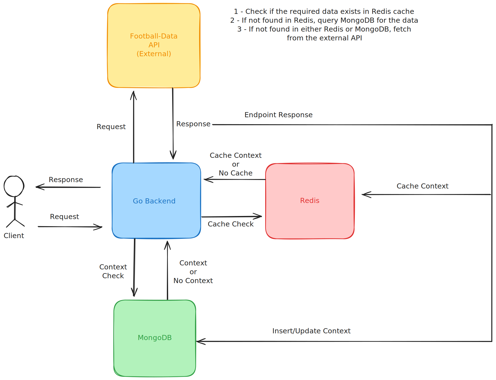

# GoRedisCache - Football Data API

## Overview
GoRedisCache is a Go-based RESTful API that provides football-related data while leveraging Redis caching to optimize performance. The application fetches data from an external football API and stores it in MongoDB, utilizing Redis for caching to reduce latency and improve efficiency.



```
----------------------------------------------------------------------------------------------
----------------------------------------------------------------------------------------------
[GIN] 2025/04/02 - 22:28:28 | 200 |  195.197083ms |             ::1 | GET      "/api/teams/11"
[GIN] 2025/04/02 - 22:28:36 | 200 |    5.332083ms |             ::1 | GET      "/api/teams/11"
----------------------------------------------------------------------------------------------
- First request returns response from external api
- Second request returns response from redis
----------------------------------------------------------------------------------------------
127.0.0.1:6379> keys *
1) "team:11"
127.0.0.1:6379> DEL team:11
----------------------------------------------------------------------------------------------
- Third request comes from mongodb
----------------------------------------------------------------------------------------------

[GIN] 2025/04/02 - 22:31:35 | 200 |  977.410334ms |             ::1 | GET      "/api/teams/11"
----------------------------------------------------------------------------------------------
----------------------------------------------------------------------------------------------
```


## Features
- Fetch areas, teams, players, and matches from an external API.
- Cache responses in Redis to enhance performance.
- Store data in MongoDB for persistence.
- Built using Gin, MongoDB, and Redis.
- Dockerized for easy deployment.

## Tech Stack 
- Go (Gin framework)
- Redis (Caching layer)
- MongoDB (Database)
- Docker (Containerization)

## Setup & Installation

### Prerequisites
Ensure you have the following installed:

- Go
- Docker
- Docker Compose

### Clone the Repository
```
git clone https://github.com/berkkaradalan/GoRedisCache.git
cd GoRedisCache
```

### Environment Variables

Create a .env file and configure the following:
```
SERVER_ADDRESS=:8080
PORT=8080
CONTEXT_TIMEOUT=2
FOOTBALL_DATA_AREA_API_URL=http://api.football-data.org/v4/areas/
FOOTBALL_DATA_TEAM_API_URL=http://api.football-data.org/v4/teams/
FOOTBALL_DATA_PLAYER_API_URL=http://api.football-data.org/v4/persons/
FOOTBALL_DATA_API_KEY=your_api_key
MONGODB_URL=mongodb
MONGODB_PORT=27017
MONGODB_DB_NAME=football-data
MONGODB_USERNAME=admin
MONGODB_PASSWORD=secret
REDIS_URL=redis
REDIS_PORT=6379
REDIS_PASSWORD=secret
```

### Run With Docker
```
docker-compose up --build -d
```

### Run Locally (Without Docker)
```
go mod tidy
go run cmd/main.go
```


## Caching Strategy

- Redis is used to store responses for 1 hour to reduce external API calls.
Cached keys are structured as:
- team --> id
- area --> id
- player --> id
<!-- - matches:team -->

If data is not found in cache, it is fetched from the external API and stored in MongoDB before caching.


#### ⚠️ Note : Some endpoints and data types may not be fully implemented or accessible due to limitations of the external football-data API, which requires a paid subscription for complete access. As a result, only the endpoints that work under the free tier are included in this project.


[My Personal Website](https://berkk.is-a.dev)